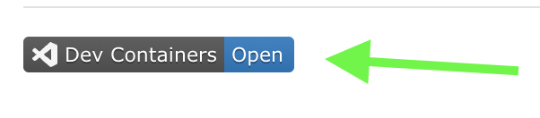

# About

Repository for learning GoLang

# How to run in Dev Container (quick way)

☝️ Click to "DevContainers Open" ☝️

or follow instructions from [How to Run in Dev Container](./how-to/1-How-To-Run-Dev-Container.md)