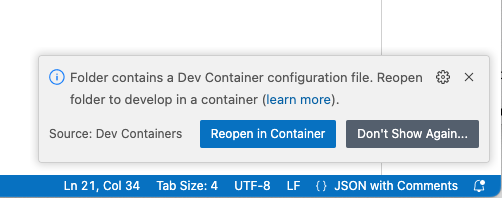
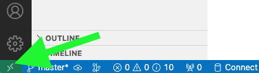
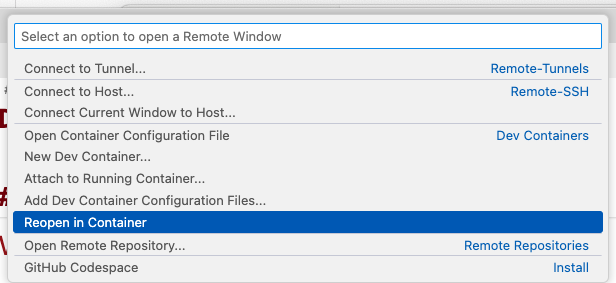

# Table of Contents  
- [Table of Contents](#table-of-contents)
- [Pre-Requisite](#pre-requisite)
- [Overview](#overview)
  - [Installed Components](#installed-components)
- [Configuration](#configuration)
  - [Mongo DB](#mongo-db)
- [Run in  Dev Container](#run-in--dev-container)

<a name="pre-requisite"/>

# Pre-Requisite
* [Visual Studio Code](https://code.visualstudio.com/)
* [Visual Studio Code - Remove Development Extension](https://marketplace.visualstudio.com/items?itemName=ms-vscode-remote.vscode-remote-extensionpack)
* Docker
* Docker Compose
* [Docker Desktop](https://www.docker.com/products/docker-desktop/)

<a name="overview"/>

# Overview

This project uses [Dev Container](https://containers.dev/) that is build with [Docker Compose](https://docs.docker.com/compose/) to include required software for homeworks

<a name="installed-components"/>

## Installed Components
* [Mongo DB](https://www.mongodb.com/)
* [Go Lang 1.21](https://go.dev/dl/)

<a name="configuration"/>

# Configuration

Below list of Environment Variables that will be required.

<a name="mongo-db-config"/>

## Mongo DB

Before proceed it will be required to create `.env` file in `.devcontainer` folder and the same file in root folder. 

**NOTE**: `.env` file by default will be excluded from source control. Do not add it.

In `.env` file specify your OpenAI API Key as following

```env
MONGO_PORT=27017
MONGO_USER=...
MONGO_PASSWORD=...
MONGO_AUTH_BASE=...
MONGO_DB=...
```

**NOTE**: Use `env-template` from root folder as template

<a name="run-dev-container"/>

# Run in  Dev Container

* Open VS Code
* Install extension [Remote Development](https://marketplace.visualstudio.com/items?itemName=ms-vscode-remote.vscode-remote-extensionpack) from Microsoft
* Open folder in VS Code. After that VS Code will suggest to open it Dev Container, as showed below. Agree and follow instructions.



* In case VS Code did not showed any popup, then we can manually reopen folder in Dev Container, as showed below. Use green link in the left bottom corner.



* In showed menu at top center choose "Reopen in container", as showed below



